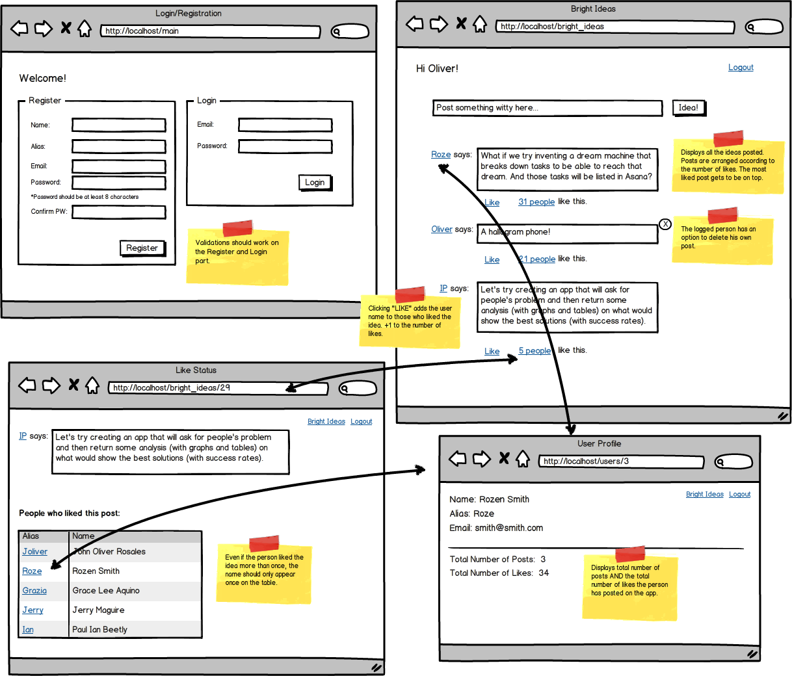

# Bright Ideas Django Project

It is a simple message board which requires registration/login. It allows you to leave messages, delete your own messages, and like messages from other users.

### It's deployed [here](http://3.131.97.33/)

Default account to log in
* **Email:** iam@bright.com
* **Password:** 12345678
